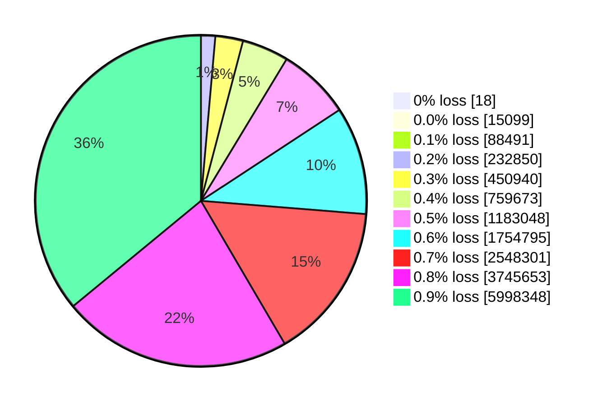

# The CSS Filter Covering Dataset

<!-- This document is generated. Do not edit numbers by hand: run
     `node docs/generate_dataset_doc.js` (from the library repo root) to
     regenerate it directly from the verified dataset artifact. -->

The dataset behind [hex-to-css-filter-library](../README.md) is a covering
certificate for sRGB: for **every one of the 16,777,216 colors** it
stores a six-function CSS filter chain whose rendered loss is under 1%.

## The artifact

- Snapshot: `2026.10.07`
- Database: `hex-to-css-filter-covering-dataset-2026.10.07.sqlite3` (1,837,748,224 bytes, uncompressed)
- Download: `hex-to-css-filter-covering-dataset-2026.10.07.sqlite3.gz` (482,760,063 bytes)

| Checksum (SHA-256) | File |
| ------------------ | ---- |
| `bb2d6b5e1696adfa5f6d689fc41d5696868ed4bc37078e35227132f94dd5717a` | `hex-to-css-filter-covering-dataset-2026.10.07.sqlite3` |
| `a5b84e204d8e9369f0174a63f79cf50519ceb1c3d1dbd4a59059319b71034b9c` | `hex-to-css-filter-covering-dataset-2026.10.07.sqlite3.gz` |

Mirrors (same bytes, same checksums, verified on download by the library):

- https://github.com/blakegearin/hex-to-css-filter-library/releases/download/dataset-2026.10.07/hex-to-css-filter-covering-dataset-2026.10.07.sqlite3.gz
- https://huggingface.co/datasets/blakegearin/hex-to-css-filter-covering-dataset/resolve/main/sqlite/hex-to-css-filter-covering-dataset-2026.10.07.sqlite3.gz
- https://data.blakegearin.com/2026.10.07/hex-to-css-filter-covering-dataset-2026.10.07.sqlite3.gz

One-command verification from an empty directory (contains the downloaded
file's checksum row; the raw `.sqlite3` row is the archive-integrity
reference. macOS: `shasum -a 256 -c -`):

```sh
curl -sSfL -O https://github.com/blakegearin/hex-to-css-filter-library/releases/download/dataset-2026.10.07/CHECKSUMS.txt \
  -O https://github.com/blakegearin/hex-to-css-filter-library/releases/download/dataset-2026.10.07/hex-to-css-filter-covering-dataset-2026.10.07.sqlite3.gz
grep 'hex-to-css-filter-covering-dataset-2026.10.07.sqlite3.gz$' CHECKSUMS.txt | sha256sum -c -
```

Licenses: the dataset is [CC-BY-4.0](https://creativecommons.org/licenses/by/4.0/),
the library code is [MIT](../LICENSE). A browsable copy of the data lives at
the Hugging Face dataset
[blakegearin/hex-to-css-filter-covering-dataset](https://huggingface.co/datasets/blakegearin/hex-to-css-filter-covering-dataset),
which is also what browser builds query over the network.

The release also carries the **optimization benchmark export** — a flat,
SQLite-free CSV (gzip) of every color's target RGB, witness parameter vector
and achieved loss, and `BENCHMARK_CHECKSUMS.txt` checksums for it. Column
spec and reproduction: [research/benchmark](../research/benchmark/README.md).

## The metric: rendered loss

`loss` is the **rendered loss** of the stored witness — *not* the legacy
continuous metric that older releases published. It is defined in words as
follows:

1. Start from black (`#000000`) and apply the stored chain — `invert`,
   `sepia`, `saturate`, `hue-rotate`, `brightness`, `contrast` — in that
   order, using the filter functions' color-matrix math at full floating-point
   precision, without rounding the result to 8-bit channels.
2. Take the absolute difference per channel between the rendered color and the
   target color: red, green and blue on the 0–255 scale, plus hue, saturation
   and lightness (computed with the classic RGB→HSL conversion, hue folded into
   the 0–100 scale, achromatic colors read as `h = 0, s = 0`).
3. Sum those six deltas. That sum is the rendered loss.

The metric is deliberately kept as the historical definition so the long-standing
"under 1% loss" claim remains comparable; it is a non-standard, mixed RGB+HSL
measure — the threshold "1" is written "1% loss", not a true percentage. A
standard colorimetric recomputation (CIEDE2000) is planned as an additional
column, tracked separately.

Because the metric re-renders from the stored `filter` text, every row can be
re-checked from the artifact alone: the script that generated this document
re-scanned all 16,777,216 rows and refuses to (re)generate unless
every row lands under 1.

## The claim, checked

- Rows: 16,777,216 (every sRGB color, `id` packed as 0xRRGGBB)
- Rows with rendered loss ≥ 1: **0**
- Maximum rendered loss: `0.9999991215` (under 1)
- Average rendered loss: 0.78803
- Exact matches (loss = 0): 18 colors
- 16,777,211 of 16,777,216 rows use
  integer percent/degree parameters; 5 colors are stored with
  0.1-granularity fractional parameters (see below).

## Loss statistics

Average|Max|Min|0%|0.0%|0.1%|0.2%|0.3%|0.4%|0.5%|0.6%|0.7%|0.8%|0.9%|Total
-------|---|---|--|----|----|----|----|----|----|----|----|----|----|-----
0.78803|0.99999|0|18|15,099|88,491|232,850|450,940|759,673|1,183,048|1,754,795|2,548,301|3,745,653|5,998,348|16,777,216



Bands: `0%` is loss exactly 0; `0.0%` is 0 < loss < 0.1; each further band is
the half-open interval [band, band + 0.1).

## Schema

`CREATE TABLE color (id INTEGER PRIMARY KEY, filter TEXT, loss REAL)`

Field|Type|Description
-----|----|-----------
`id`|`INTEGER`|Primary key: the target color packed as 0xRRGGBB (red in the high byte). It is also the row offset in the Parquet mirror.
`filter`|`TEXT`|The witness chain verbatim: six CSS filter functions applied to black — `invert() sepia() saturate() hue-rotate() brightness() contrast()`.
`loss`|`REAL`|Rendered loss of the stored chain, defined above; under 1 for every row. Legacy databases published the pre-rounding continuous metric here instead — do not compare the two.

## Fractional-parameter exceptions

Searches optimize over integers, but 5 extreme-saturation
colors could only be certified with 0.1-granularity fractional parameters. They
are stored as-is and served verbatim; every other row is integer:

Color|Filter chain|Loss
-----|-----------|----
`#fbfc02`|`invert(26.2%) sepia(78.3%) saturate(4245.5%) hue-rotate(56.9deg) brightness(241.7%) contrast(98.3%)`|0.96976
`#fbfc03`|`invert(95.9%) sepia(3%) saturate(14349.1%) hue-rotate(18deg) brightness(137%) contrast(98%)`|0.95717
`#fbfc1f`|`invert(91.6%) sepia(15.8%) saturate(7661.2%) hue-rotate(39.7deg) brightness(223.8%) contrast(97.5%)`|0.88111
`#fcfd02`|`invert(78.3%) sepia(30.6%) saturate(10529.8%) hue-rotate(35.3deg) brightness(170.2%) contrast(98.6%)`|0.74435
`#fcfd03`|`invert(74.5%) sepia(11.6%) saturate(10489.7%) hue-rotate(51deg) brightness(281.3%) contrast(98.6%)`|0.93993

## Example record

```js
// #42dead
'invert(95%) sepia(18%) saturate(20940%) hue-rotate(66deg) brightness(157%) contrast(74%)' // loss: 0.8793432176
```

## Regenerating this document

With the cached artifact in place (`node docs/generate_dataset_doc.js`), the
script verifies the file's size and pinned SHA-256, then re-runs the full scan
and rewrites this file plus the generated regions of `README.md`. Against a
manual copy: `node docs/generate_dataset_doc.js --db /path/to/hex-to-css-filter-covering-dataset-2026.10.07.sqlite3`.
