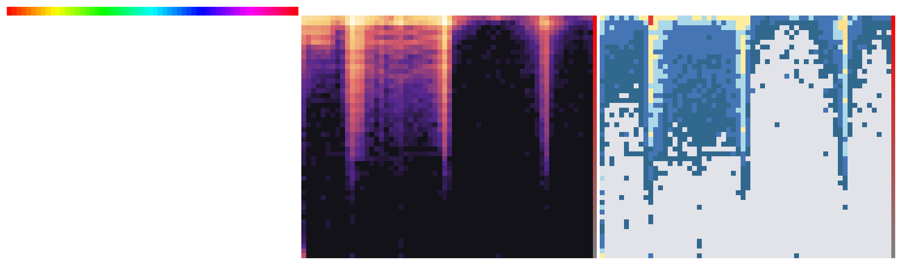

# Hardness map: which color regions resisted search

The covering claim of the [dataset](../../docs/dataset.md) is uniform — every color has a witness under the loss threshold — but the *search* was not. This tool turns the rebuild's escalation history into a publishable artifact: which colors resisted each budget level, where they cluster in color space, and why exactly five colors needed a different search model (fractional parameters) to close.

**No searches are re-run.** Per-color hardness ("which round first certified it") comes from the six survivor lists retained between rounds, and final per-color loss comes from the [dataset artifact](https://github.com/blakegearin/hex-to-css-filter-library/releases/tag/dataset-2026.10.07), re-rendered through the independent [verifier](../verifier/verify_covering.py) so every published number shares the covering claim's single trust path.

## The escalation record

The rebuild solved the cube in stages of increasing per-color budget, retaining the survivor list after each stage. A color's **stage** is the stage that first certified it:

| Stage | Round | Per-color budget | Solved here | Still unsolved |
| ----- | ----- | ---------------- | ----------: | -------------: |
| 0 | first-pass coverage | fixed-budget full pass (not retained in logs) | 16,640,429 | 136,787 |
| 1 | round 2 | 6,000,000 evals (1 warm + 5 cold restarts) | 106,777 | 30,010 |
| 2 | round 3 | 24,000,000 evals (1 warm + 5 cold restarts) | 25,110 | 4,900 |
| 3 | round 4 | 60,000,000 evals (1 warm + 5 cold restarts) | 3,966 | 934 |
| 4 | phase 5 | until-solved: no budget cap | 905 | 29 |
| 5 | phase 6 | until-solved: no budget cap | 24 | 5 |
| 6 | phase 7 | fractional closure (0.1-granularity, seconds-scale) | 5 | 0 |

Metadata (banner text, targets, durations where the logs retained them) is embedded in [`data/round_history.json`](data/round_history.json) together with the survivor lists themselves (delta-packed + zlib, 224 KB total). Round banners all say "Round 2" because one campaign script drove every round. The escape targets (`<0.999`, `<0.99`, `<0.998`) are transcribed verbatim — including round 3's `<0.99`, which reads like a typo for a tighter margin but is exactly what `work/logs/round3.log` records. All targets sit below the certification threshold of 1, so every witness ever stored satisfies the claim under any of them.

## Files

| Path | What |
| ---- | ---- |
| `data/round_history.json` | committed input: the six survivor lists + transcribed round metadata |
| `data/hardness_regions.csv` | per-region residual statistics on an HSL grid of the targets |
| `data/hardness_summary.json` | headline numbers for the writeup (stage tables, saturation bands, case study) |
| `hardness_map.png` | rendered two-panel map (below) |
| `build_hardness_map.py` | the script (stdlib only, imports the verifier) |

Region grid: hue sectors of 6° × saturation bands of 2 % × lightness bands of 10 % of the *target* color, plus one achromatic pseudo-sector for the 256 pure grays (hue undefined there). 29,176 populated regions per dataset snapshot. Columns include solved-at-stage counts and the recomputed loss mean/max over all rows and over the region's survivor rows.

## The map



Left panel: survivor density per (hue, saturation) cell, lightness marginalized, log-scaled — black cells had no survivors at all (the first pass solved every color there). Right panel: the hardest tier reached in each cell, from light gray (first pass, no survivors) through blue (early budget rounds), yellow (the two no-budget-cap passes), to red (the five fractional-parameter colors). Bottom row of each grid is saturation 0–2 %, top row is 98–100 %. The hue swatch strip and the gray→saturated bar are orientation aids, not data.

Reading it: the action hugs the top rim (extreme saturations). Hard blue towers (budget rounds) rise across most hues along the rim, with hard columns at the yellow sector (60–66°) and in the magenta/pink range, and white arcs inside the rim are cells the first pass cleared even at high saturation. In the left panel the same structure appears as two glow columns (yellow, magenta) against a mid-saturation haze — visually, the inverse map goes knife-edge exactly where the forward map presses against the clamp walls.

## Findings

### 1. Hardness clusters near extreme saturations — by 5.9×

Survivor rates per saturation band (this is the quantified form of the claim — per-2 %-band numbers in `hardness_summary.json` → `saturationBands`, exact populations over all 16,777,216 colors):

| Saturation | Colors | Survivors | Rate |
| ---------- | -----: | --------: | ----: |
| 0–10 % | 165,682 | 178 | 0.107 % |
| 10–40 % | 2,482,692 | 229 | 0.009 % |
| 40–50 % | 1,494,042 | 1,102 | 0.074 % |
| 50–90 % | 9,281,838 | 43,106 | 0.464 % |
| 90–100 % | 3,352,962 | 92,172 | 2.749 % |

The rate rises monotonically across the mid range (0.36 % at 70–72 %, 1.33 % at 88–90 % by 2 %-band) and steps up again in the S ≥ 90 % zone, where it bottoms at 1.20 % and peaks at 5.17 % (96–98 %) and 3.91 % (98–100 %) — the hottest mid-band, 56–58 %, sits at 0.19 %. Below 40 % saturation the rate drops below 0.05 % for the whole 10–40 % span. Extremes in *both* directions are elevated: the 0–2 % band shows 1.61 %, traced to its 108 survivors concentrating in tiny near-neutral cells at 60–90 % lightness — the same knife-edge gray boundary (achromatic hue luck) the verifier documents.

In hue, the S ≥ 98 % survivors pile into yellow (hue 60–66°, the sector containing all five fractional rows) — saturate() multiplies chroma most freely near yellow before the clamps shear the chain off, so extreme presentation ever rendered by the model tends to be yellow-ward.

### 2. Budget exhaustion saturates into floors

The largest budget round spent 60,000,000 evaluations **per color** — still only 6×10⁻⁹ of the integer parameter box (101 × 101 × 30,001 × 361 × 301 × 301 = 10,009,644,918,539,161 cells, `integerLattice.parameterSpaceCells` in the summary). The two until-solved passes removed any cap, annealing until each color was certified — and they still left 29, then 5, colors unsolved at the 0.998 target. That is the direct evidence that budget exhaustion and model limits are separable: the last holdouts were not *slow*, they were outside what the search model could represent.

### 3. The integer-floor case study: five extreme yellows

The five colors that survived both unlimited-budget passes are all in the yellow 60–66° sector at S ≈ 98.4 % (`#fbfc02 #fbfc03 #fbfc1f #fcfd02 #fcfd03`). Phase 7 closed them by annealing at 0.1-granularity instead of integers — the only stage of the rebuild that abandons integer parameters. The "best integer found" column is the deterministic post-hoc probe (`case-study` mode: multi-start greedy descent over the integer lattice, seeded from the stored fractional witness and saturate offsets, bounded and reproducible at 1,784–3,231 lattice evaluations each — *not* the historical search):

| Color | Fractional loss stored | Round to integer | Floor to integer | Best integer found by probe |
| ----- | ---------------------: | ---------------: | ---------------: | --------------------------: |
| #fbfc02 | 0.9698 | 2.6716 | 6.8703 | 1.1290 |
| #fbfc03 | 0.9572 | 1.0364 | 1.8006 | **0.9556** |
| #fbfc1f | 0.8811 | 3.8495 | 4.2485 | 1.4098 |
| #fcfd02 | 0.7444 | 3.8100 | 1.9041 | 2.0663 |
| #fcfd03 | 0.9399 | 4.8197 | 3.7378 | 1.6233 |

Three facts make this the paper's cleanest illustration that the parameter→color map is smooth while its *integer inverse* is discontinuous:

- The fractional witnesses sit at loss 0.74–0.97, comfortably under the claim, but **every simple rounding of them** (floor, round, ceil) lands at 1.04–15.08 — above the certification threshold. The nearest integer lattice points to a sub-threshold witness are not near-witnesses.

- Four of the five stay above threshold even under the probe (best found 1.13–2.07): whether a true sub-threshold integer witness exists anywhere in their lattice neighborhoods is unknown, and the historical no-cap searches and the probe together say "not anywhere reachable from here".

- The exception, #fbfc03, has a *pocket* reaching 0.9556 at integer saturate(14481) — 132 units (≈ 0.9 %) away from the fractional optimum's 14349.1 — while all adjacent points sit at ≥ 1.80. A sub-threshold integer witness exists but is fenced off from its fractional cousin by a wall of failing lattice points. The until-solved searches never landed in it.

That is why the dataset stores these five rows with one decimal place of granularity: for them, "did the 6-D integer lattice contain a witness under 1 near the optimum" and "did the search find one" have the same answer, and the fractional island next door closes the gap.

### 4. Residual loss by stage is flat — by construction

Recomputed-loss means per stage run 0.77–0.83 for stages 0–5 and 0.899 for stage 6 (which hugs the threshold at 0.74–0.97 by definition of being last). The escalation ladder was driven by *solvability* at the acceptance target, not by final loss quality — hardness here is "how much budget a color took", not "how wrong its witness is". All 16,777,216 rows were re-verified during `map`: zero failures, zero unparseables, and the only two stored-loss tolerance flags are the two documented pre-rounding metric artifacts (#010101, #e2e2e2 — see the verifier README).

### Caveats

- Stage attribution uses *first survivor list membership*, which pins the round that certified a color's witness. Later polish passes could overwrite a witness without changing attribution, so an early stage's recomputed max can sit slightly above that round's acceptance target (observed 0.9999–0.999999 for stages 1–2). Nothing crosses 1.0.

- "Best integer found by probe" is a lower bound on the true integer floor, not a certified optimum — the probe's budget is stated per row in the summary JSON's `integerLattice.caseStudy[].probe` strings.

## Reproducing

From the repo root (or anywhere you keep the dataset cached — the verifier's `resolve_db_path` finds the cached artifact automatically):

```sh
# all checks (needs data/round_history.json, committed)
python3 research/hardness/build_hardness_map.py selftest -v

# regenerate the region CSV, summary JSON, and figure (~30 s, 8 workers)
python3 research/hardness/build_hardness_map.py map --jobs 8 --hash

# re-render just the figure from the CSV (<1 s)
python3 research/hardness/build_hardness_map.py figure

# the five-color integer-lattice case study (~4 s)
python3 research/hardness/build_hardness_map.py case-study
```

`map` re-renders every row through the verifier (the same ~30 s, multiprocess id-range scan the release gate uses), aggregates regions and per-stage tables in one pass, and writes byte-identical CSV and PNG on rerun (ordered worker merge). `hardness_summary.json` carries rerun-local fields (`generatedAt`, `runtimeSeconds`, dataset path) so it is stable in content but not byte-identical. `derive --archive DIR` rebuilds `round_history.json` from the original rebuild archive (the six `survivors*.txt` files) and validates nesting + counts. On this machine the archive is `~/Repos/hex-to-css/work/data`.

The arXiv note should read `hardness_summary.json` for headline numbers and can embed `hardness_map.png` directly. `hardness_regions.csv` carries the full grid for any re-plots.
